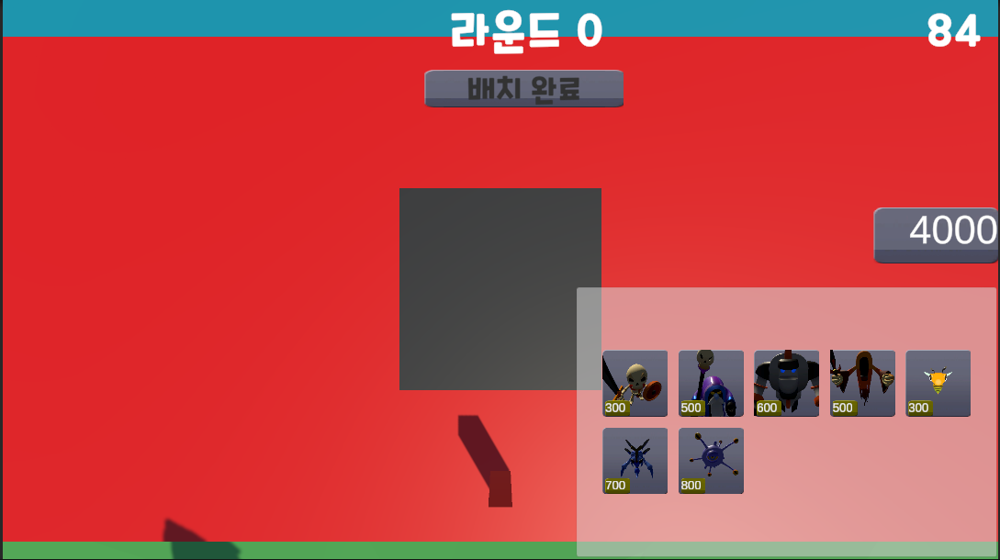

# MonsterChess
* 플레이 영상 : <https://www.youtube.com/watch?v=qKIiIdELATE>
* 다운로드 : <https://naver.me/x0UgC7i8>
  


***

* 작업 기간 : 2024. 12. 01 ~ 2025. 01. 26 (2개월)
* 인력 구성 : 1명
* 사용언어 및 개발환경 : C#, Unity

# Behavior Tree
* 몬스터의 AI를 Behavior Tree로 구성
* Behavior Tree는 서버에서 작동
  


<details>
<summary>Behavior Tree(Server) 코드</summary>
	
```cs
// 몬스터가 기본 베이스로 쓰는 변수를 모아놓은 BlackBoard이다. 
namespace ServerContent
{
    public class BlackBoard
    {
        public b_Object m_TargetObject = new b_Object();
        public b_float m_HP = new b_float();
        public b_float m_AttackDistance = new b_float();
        public b_float m_AttackRange = new b_float();
        public b_float m_AttackRangeCorrectionValue = new b_float();
        public b_float m_DefaultAttackDamage = new b_float();
        public b_float m_MoveSpeed = new b_float();
        public b_float m_ProjectTileSpeed = new b_float();
    }
}

// Selector, Sequence 노드 정의
namespace ServerContent
{
    // 노드를 만들기 위한 최상위 부모이다.
    public class ActionNode
    {
        public virtual ReturnCode Tick()
        {
            return ReturnCode.SUCCESS;
        }
    }

    // 생성할 때 Func 변수를 받아와 행동을 저장하고 Tick을 이용해 원할 때 실행할 수 있다.
    public class Action : ActionNode
    {
        Func<ReturnCode> m_Action;

        public Action(Func<ReturnCode> act)
        {
            m_Action = act;
        }

        public override ReturnCode Tick()
        {
            return m_Action.Invoke();
        }
    }

    // Behavior Tree의 기본 분기(Selector, Sequence의 기본틀)
    class Composite : ActionNode
    {
        // 전체 노드 수
        private static int g_NodeCount = -1;
        // 각각 노드 번호
        private int m_NodeCount = 0;
        // 몇번째 자식을 돌고 있는지 판별용
        protected int m_CurrentChild = 0;
        // 자식 리스트
        protected List<ActionNode> m_Children = new List<ActionNode>();
       
        // Decorate 미사용
        protected Composite()
        {
            Init();
        }

        protected virtual void Init()
        {
            g_NodeCount++;
            m_NodeCount = g_NodeCount;
        }

        public void AddChild(ActionNode child)
        {
            m_Children.Add(child);
        }

        public override ReturnCode Tick()
        {
            return ReturnCode.SUCCESS;
        }
    }

    // 인자값끼리 비교 체크 할 수 있다.
    // HP가 0 이하인지 체크하고 싶을 때 참조를 가진 현재 HP와 0인걸 체크하고 싶으니깐 0을 인자로 넣어주면 비교 할 수 있고 0일 때를 체크할 수 있다.
    class Composite<T, K> : Composite where T : IComparable where K : IBlackBoardKey<T>
    {
        // 블랙 보드 키값 비교용
        // 쿼리에 따라 비교
        private KeyQuery m_KeyQuery = KeyQuery.None;
        // 사용자 입력 값
        private T m_Key = default(T);
        // 참조를 위해 클래스 사용
        private K m_BlackBoardKey = default(K);
       
        protected bool UseSet = false;

        private Dictionary<KeyQuery, Func<IComparable, IComparable, bool>> m_QueryFuncMap = new Dictionary<KeyQuery, Func<IComparable, IComparable, bool>>();

        protected Composite(KeyQuery keyQuery, T keyValue, K blackBoardKey)
        {
            m_KeyQuery = keyQuery;
            m_Key = keyValue;
            m_BlackBoardKey = blackBoardKey;
        }

        protected override void Init()
        {
            base.Init();
            m_QueryFuncMap.Add(KeyQuery.IsEqualTo, DecorateFunc<IComparable>.IsEqualTo);
            m_QueryFuncMap.Add(KeyQuery.IsNotEqualTo, DecorateFunc<IComparable>.IsNotEqualTo);
            m_QueryFuncMap.Add(KeyQuery.IsLessThan, DecorateFunc<IComparable>.IsLessThan);
            m_QueryFuncMap.Add(KeyQuery.IsLessThanOrEqualTo, DecorateFunc<IComparable>.IsLessThanOrEqualTo);
            m_QueryFuncMap.Add(KeyQuery.IsGreaterThan, DecorateFunc<IComparable>.IsGreaterThan);
            m_QueryFuncMap.Add(KeyQuery.IsGreaterThanOrEqualTo, DecorateFunc<IComparable>.IsGreaterThanOrEqualTo);
        }

        protected bool DecorateCheck()
        {
            Func<IComparable, IComparable, bool> func;

            if (m_QueryFuncMap.TryGetValue(m_KeyQuery, out func))
            {
                if (func.Invoke(m_Key, m_BlackBoardKey.Key))
                {
                    return true;
                }

                return false;
            }

            return false;
        }
    }

    // 위와 비슷하지만 값의 비교가 아니라 현재 클래스가 유효한지 판정하기 위해서 사용한다.
    class SetComposite<T, K> : Composite where K : IBlackBoardKey<T>
    {
        // IsSet 비교용
        // 쿼리에 따라 비교
        private KeyQuery m_KeyQuery = KeyQuery.None;
        // 참조를 위해 클래스 사용
        private K m_BlackBoardKey = default(K);
       
        private Dictionary<KeyQuery, Func<K, bool>> m_QueryFuncMap = new Dictionary<KeyQuery, Func<K, bool>>();

        protected SetComposite(KeyQuery keyQuery, K blackBoardKey)
        {
            m_KeyQuery = keyQuery;
            m_BlackBoardKey = blackBoardKey;
        }

        protected override void Init()
        {
            base.Init();
            m_QueryFuncMap.Add(KeyQuery.IsEqualTo, SetDecorateFunc<T, K>.IsSet);
            m_QueryFuncMap.Add(KeyQuery.IsNotEqualTo, SetDecorateFunc<T, K>.IsNotSet);
        }

        protected bool DecorateCheck()
        {
            if (m_KeyQuery == KeyQuery.IsSet)
            {
                return SetDecorateFunc<T, K>.IsSet(m_BlackBoardKey);
            }

            return SetDecorateFunc<T, K>.IsNotSet(m_BlackBoardKey);
        }
    }

    // 자손이 모두 성공해야 Sequence도 성공
    class Sequence : Composite
    {
        public override ReturnCode Tick()
        {
            for (int i = m_CurrentChild; i < m_Children.Count; i++)
            {
                ReturnCode childStatus = m_Children[i].Tick();

                m_CurrentChild = i;

                if (childStatus == ReturnCode.RUNNING)
                {
                    return ReturnCode.RUNNING;
                }
                else if (childStatus == ReturnCode.FAIL)
                {
                    m_CurrentChild = 0;
                    return ReturnCode.FAIL;
                }
            }
            m_CurrentChild = 0;
            return ReturnCode.SUCCESS;
        }
    }

    // Sequnce의 인자 비교 버전
    class Sequence<T, K> : Composite<T, K> where T : IComparable where K : IBlackBoardKey<T>
    {
        public Sequence(KeyQuery keyQuery, T keyValue, K blackBoardKey) : base(keyQuery, keyValue, blackBoardKey)
        {

        }

        public override ReturnCode Tick()
        {
            if (!DecorateCheck()) return ReturnCode.FAIL;

            for (int i = m_CurrentChild; i < m_Children.Count; i++)
            {
                ReturnCode childStatus = m_Children[i].Tick();

                m_CurrentChild = i;

                if (childStatus == ReturnCode.RUNNING)
                {
                    return ReturnCode.RUNNING;
                }
                else if (childStatus == ReturnCode.FAIL)
                {
                    m_CurrentChild = 0;
                    return ReturnCode.FAIL;
                }
            }
            m_CurrentChild = 0;
            return ReturnCode.SUCCESS;
        }
    }

    // 값이 유효한지 알아보는 버전
    class SetSequence<T, K> : SetComposite<T, K> where K : IBlackBoardKey<T>
    {
        public SetSequence(KeyQuery keyQuery, K blackBoardKey) : base(keyQuery, blackBoardKey)
        {

        }

        public override ReturnCode Tick()
        {
            if (!DecorateCheck()) return ReturnCode.FAIL;

            for (int i = m_CurrentChild; i < m_Children.Count; i++)
            {
                ReturnCode childStatus = m_Children[i].Tick();

                m_CurrentChild = i;

                if (childStatus == ReturnCode.RUNNING)
                {
                    return ReturnCode.RUNNING;
                }
                else if (childStatus == ReturnCode.FAIL)
                {
                    m_CurrentChild = 0;
                    return ReturnCode.FAIL;
                }
            }
            m_CurrentChild = 0;
            return ReturnCode.SUCCESS;
        }
    }

    // 자손이 모두 실패하면 셀럭터도 실패 
    class Selector : Composite
    {
        public override ReturnCode Tick()
        {
            for (int i = m_CurrentChild; i < m_Children.Count; i++)
            {
                ReturnCode childStatus = m_Children[i].Tick();

                m_CurrentChild = i;

                if (childStatus == ReturnCode.RUNNING)
                {
                    return ReturnCode.RUNNING;
                }
                else if (childStatus == ReturnCode.SUCCESS)
                {
                    m_CurrentChild = 0;
                    return ReturnCode.SUCCESS;
                }
            }
            m_CurrentChild = 0;
            return ReturnCode.FAIL;
        }
    }

    // Selector의 인자 비교 버전
    class Selector<T, K> : Composite<T, K> where T : IComparable where K : IBlackBoardKey<T>
    {
        public Selector(KeyQuery keyQuery, T keyValue, K blackBoardKey) : base(keyQuery, keyValue, blackBoardKey)
        {

        }

        public override ReturnCode Tick()
        {
            if (!DecorateCheck()) return ReturnCode.FAIL;

            for (int i = m_CurrentChild; i < m_Children.Count; i++)
            {
                ReturnCode childStatus = m_Children[i].Tick();

                m_CurrentChild = i;

                if (childStatus == ReturnCode.RUNNING)
                {
                    return ReturnCode.RUNNING;
                }
                else if (childStatus == ReturnCode.SUCCESS)
                {
                    m_CurrentChild = 0;
                    return ReturnCode.SUCCESS;
                }
            }
            m_CurrentChild = 0;
            return ReturnCode.FAIL;
        }
    }

    // 값이 유효한지 알아보는 버전
    class SetSelector<T, K> : SetComposite<T, K> where K : IBlackBoardKey<T>
    {
        public SetSelector(KeyQuery keyQuery, K blackBoardKey) : base(keyQuery, blackBoardKey)
        {

        }

        public override ReturnCode Tick()
        {
            if (!DecorateCheck()) return ReturnCode.FAIL;

            for (int i = m_CurrentChild; i < m_Children.Count; i++)
            {
                ReturnCode childStatus = m_Children[i].Tick();

                m_CurrentChild = i;

                if (childStatus == ReturnCode.RUNNING)
                {
                    return ReturnCode.RUNNING;
                }
                else if (childStatus == ReturnCode.SUCCESS)
                {
                    m_CurrentChild = 0;
                    return ReturnCode.SUCCESS;
                }
            }
            m_CurrentChild = 0;
            return ReturnCode.FAIL;
        }
    }
}

// Behavior Tree에서 값 끼리 비교를 선택했을 때 비교해주는 함수
namespace ServerContent
{
    public class DecorateFunc<T> where T : IComparable
    {
        // 값이 같은지 비교 
        static public bool IsEqualTo(T keyValue, T blackBoardKey)
        {
            if (blackBoardKey.CompareTo(keyValue) == 0)
            {
                return true;
            }

            return false;
        }

        // 값이 다른지 비교
        static public bool IsNotEqualTo(T keyValue, T blackBoardKey)
        {
            if (blackBoardKey.CompareTo(keyValue) != 0)
            {
                return true;
            }

            return false;
        }

        // 값이 작은지 비교 
        static public bool IsLessThan(T keyValue, T blackBoardKey)
        {
            if (blackBoardKey.CompareTo(keyValue) < 0)
            {
                return true;
            }

            return false;
        }

        // 값이 작거나 같은지 비교 
        static public bool IsLessThanOrEqualTo(T keyValue, T blackBoardKey)
        {
            if (blackBoardKey.CompareTo(keyValue) <= 0)
            {
                return true;
            }

            return false;
        }

        // 값이 큰지 비교 
        static public bool IsGreaterThan(T keyValue, T blackBoardKey)
        {
            if (blackBoardKey.CompareTo(keyValue) > 0)
            {
                return true;
            }

            return false;
        }

        // 값이 크거나 같은지 비교  
        static public bool IsGreaterThanOrEqualTo(T keyValue, T blackBoardKey)
        {
            if (blackBoardKey.CompareTo(keyValue) >= 0)
            {
                return true;
            }

            return false;
        }
    }

    public class SetDecorateFunc<T, K> where K : IBlackBoardKey<T>
    {
        // 값이 유효한지 
        static public bool IsSet(K blackBoardKey)
        {
            if (blackBoardKey.Key == null) return false;

            if (blackBoardKey.Key is null)
                return false; // 참조형이 null이면 값 없음
            
            if (EqualityComparer<T>.Default.Equals(blackBoardKey.Key, default(T)))
                return false; // 값 형식이 기본값(0, false 등)이면 값 없음

            return true; // 값이 있는 경우
        }

        // 값이 유효하지 않은지
        static public bool IsNotSet(K blackBoardKey)
        {
            if (blackBoardKey.Key == null) return true;

            if (blackBoardKey.Key is null)
                return true; // 참조형이 null이면 값 없음

            if (EqualityComparer<T>.Default.Equals(blackBoardKey.Key, default(T)))
                return true; // 값 형식이 기본값(0, false 등)이면 값 없음

            return false; // 값이 있는 경우
        }
    }
}

 // 블랙보드 키값 세팅 json 파일을 이용해서 데이터를 가져와 적용한다.
 protected override void SetBlackBoardKey()
 {
     // 클라에서 이름 정보 받아오면 이름 정보로 교체
     m_BlackBoard.m_TargetObject.Key = m_TargetLab;
     m_BlackBoard.m_HP.Key = Managers.Data.m_MonsterDict[m_Name].hp;
     m_BlackBoard.m_AttackDistance.Key = Managers.Data.m_MonsterDict[m_Name].attackDistance;
     m_BlackBoard.m_AttackRange.Key = Managers.Data.m_MonsterDict[m_Name].attackRange;
     m_BlackBoard.m_AttackRangeCorrectionValue.Key = Managers.Data.m_MonsterDict[m_Name].attackRangeCorrectionValue;
     m_BlackBoard.m_DefaultAttackDamage.Key = Managers.Data.m_MonsterDict[m_Name].defaultAttackDamage;
     m_BlackBoard.m_MoveSpeed.Key = Managers.Data.m_MonsterDict[m_Name].moveSpeed;
     m_BlackBoard.m_ProjectTileSpeed.Key = Managers.Data.m_MonsterDict[m_Name].projectTileSpeed;
 }

// 캐릭터에 맞는 Behavior Tree를 생성한다.
private void MakeBehaviorTree()
{
    // HP관리
    // 공격 관리
    Selector attackMgr = new Selector();
    m_Selector.AddChild(attackMgr);

    SetSequence<object, b_Object> checkTargetLive = new SetSequence<object, b_Object>(KeyQuery.IsSet, m_BlackBoard.m_TargetObject);
    attackMgr.AddChild(checkTargetLive);

    Sequence<float, b_float> checkAttackRange = new Sequence<float, b_float>(KeyQuery.IsLessThanOrEqualTo, m_BlackBoard.m_AttackRange.Key, m_BlackBoard.m_AttackDistance);
    checkTargetLive.AddChild(checkAttackRange);

    Action attackAction = new Action(Attack);
    checkAttackRange.AddChild(attackAction);

    // 이동 관리
    Selector moveMgr = new Selector();
    m_Selector.AddChild(moveMgr);

    SetSequence<object, b_Object> move = new SetSequence<object, b_Object>(KeyQuery.IsSet, m_BlackBoard.m_TargetObject);
    moveMgr.AddChild(move);
    Action moveAction = new Action(MoveToPosition);

    move.AddChild(moveAction);
}

// 위의 Action으로 넣어준 함수 두가지

// 공격하는 패킷을 클라이언트로 쏘아준다.
 private ReturnCode Attack()
 {
     m_MonsterState = MonsterState.Attack;
     S_BroadcastMonsterStatePacket monsterStatePacket = new S_BroadcastMonsterStatePacket();
     monsterStatePacket.m_MonsterId = (ushort)m_ObjectId;
     monsterStatePacket.m_CurrentState = (ushort)m_MonsterState;
     monsterStatePacket.m_PosX = m_Position.X;
     monsterStatePacket.m_PosY = m_Position.Y;
     monsterStatePacket.m_PosZ = m_Position.Z;

     TransportPacket(() => Program.g_GameRoom.BroadCast(monsterStatePacket.Write()));
     
     return ReturnCode.SUCCESS;
 }

// 몬스터의 상태랑 현재 위치를 패킷으로 쏘아보낸다. 
private ReturnCode MoveToPosition()
{
    m_MonsterState = MonsterState.Move;
    Vector3 dir = m_Target.m_Position - m_Position;

    if (dir == Vector3.Zero)
    {
        dir = Vector3.Zero;
    }
    else
    {
        dir = Vector3.Normalize(dir);
    }
    float fixY = m_Position.Y;
    m_Position += dir * m_BlackBoard.m_MoveSpeed.Key * (float)LTimer.m_SPF;
    m_Position = new Vector3(m_Position.X, fixY, m_Position.Z);
    // 패킷 보내기
    S_BroadcastMovePacket movePacket = new S_BroadcastMovePacket();
    movePacket.m_MonsterId = (ushort)m_ObjectId;
    movePacket.m_PosX = m_Position.X;
    movePacket.m_PosY = m_Position.Y;
    movePacket.m_PosZ = m_Position.Z;

    S_BroadcastMonsterStatePacket monsterStatePacket = new S_BroadcastMonsterStatePacket();
    monsterStatePacket.m_MonsterId = (ushort)m_ObjectId;
    monsterStatePacket.m_CurrentState = (ushort)m_MonsterState;

    TransportPacket(() => Program.g_GameRoom.BroadCast(monsterStatePacket.Write()));
    TransportPacket(() => Program.g_GameRoom.BroadCast(movePacket.Write()));
    
    return ReturnCode.SUCCESS;
}

```

</details>

* 클라이언트에선 서버에서 보내준 상태를 받아와서 상태에 따라 애니메이션을 재생시켜줍니다.

<details>
<summary> Behavior Tree(Client) 코드</summary>
	
```cs
// 브로드캐스트 된 패킷을 받아 역직렬화 하고 몬스터 ID를 이용해 해당하는 몬스터에게 현재 상태를 넣어준다.
public void S_BroadcastMonsterStatePacketHandler(Session session, IPacket packet)
{
    S_BroadcastMonsterStatePacket monsterStatePacket = packet as S_BroadcastMonsterStatePacket;
    GameObject obj = Managers.Monster.GetMonster(monsterStatePacket.m_MonsterId);

    if (obj != null)
    {
        Vector3 serverPos = new Vector3(monsterStatePacket.m_PosX, monsterStatePacket.m_PosY, monsterStatePacket.m_PosZ);
       
        if (obj.GetComponent<BaseMonster>().MonsterState != MonsterState.Attack &&
            (MonsterState)monsterStatePacket.m_CurrentState == MonsterState.Attack)
        {
            if (Vector3.Distance(obj.transform.position, serverPos) >= 0.1f)
            {
                if (obj.layer != (int)Global.g_MyTeam) return;
                C_ConfirmMovePacket confirmMovePacket = new C_ConfirmMovePacket();
                confirmMovePacket.m_MonsterId = (ushort)obj.GetComponent<BaseObject>().ObjectId;
                SessionManager.Instance.GetServerSession().Send(confirmMovePacket.Write());
                return;
            }
        }
        obj.GetComponent<BaseMonster>().MonsterState = (MonsterState)monsterStatePacket.m_CurrentState;
    }
}

// 유니티 Update에서 패킷으로 받아온 상태가 바뀌면 상태에 따른 애니메이션을 재생시켜준다.
private void StateUpdate()
{
    switch (MonsterState)
    {
        case MonsterState.Idle:
            IDLE();
            break;
        case MonsterState.Move:
            Move();
            break;
        case MonsterState.Attack:
            Attack();
            break;
        case MonsterState.None:
            break;
        default:
            break;
    }
}

// IDLE은 기본 애니메이션으로 설정했기에 따로 행동이 없다.
private void IDLE()
{
    
}

// 애니메이션을 재생하고 서버에서 받아온 좌표를 받아 이동한다. 
private void Move()
{
    monsterAnimation.SetBool("IsMove", true);
    transform.LookAt(Target.transform);
    transform.position = Vector3.MoveTowards(gameObject.transform.position, MovePos, blackBoard.m_MoveSpeed.Key * Time.deltaTime);
    Vector3 fixYPos = new Vector3(transform.position.x, initialY, transform.position.z);
    transform.position = fixYPos;
}

// 몬스터가 죽었을 때 애니메이션 재생과 알파값 조절로 투명화 죽었을 때 이벤트를 뿌린다.
public override void Death()
{
    monsterAnimation.SetBool("IsDeath", true);
    StartCoroutine(DecreaseAlpha());
    IsDeath = true;
    BaseMonster.monsterDeathEvent.Invoke();
}
```

</details>

# Server
* 비동기 함수를 이용해 패킷을 주고받음
  




<details>
<summary> Server 코드</summary>
	
```cs

// 비동기적으로 클라이언트가 접속하는걸 기다린다.
public class Listener
{
    Func<Session> m_SessionFactory;
    Socket m_Socket;
    SocketAsyncEventArgs m_ListenArgs = new SocketAsyncEventArgs();

    // 리스닝 소켓 바인딩 리스닝, 이벤트 등록
    public void Init(Func<Session> sessionFunc, int listenCount)
    {
        string host = Dns.GetHostName();
        IPHostEntry ipHost = Dns.GetHostEntry(host);
        IPAddress ipAddr = IPAddress.Parse("192.168.0.5");
        IPEndPoint endPoint = new IPEndPoint(ipAddr, Global.g_PortNumber);
        m_Socket = new Socket(endPoint.AddressFamily, SocketType.Stream, ProtocolType.Tcp);

        m_Socket.Bind(endPoint);
        m_Socket.Listen(listenCount);

        m_ListenArgs.Completed += OnAcceptCompleted;
        m_SessionFactory += sessionFunc;
    }

    public void Start()
    {
        RgisterAccept();
    }

    // 비동기적으로 클라이언트가 접속하는걸 기다리며 접속할 경우 pending이 false가 된다.
    void RgisterAccept()
    {
        m_ListenArgs.AcceptSocket = null;

        bool pending = m_Socket.AcceptAsync(m_ListenArgs);
        if (pending == false)
            OnAcceptCompleted(null, m_ListenArgs);
    }

    // 클라이언트가 접속을 시도했을 때 별다른 에러가 없다면 세션을 생성해준다.
    void OnAcceptCompleted(object sender, SocketAsyncEventArgs args)
    {
        if (args.SocketError == SocketError.Success)
        {
            Console.WriteLine("클라이언트와 연결 성공");

            try
            {
                Session session = m_SessionFactory.Invoke();
                session.Init(args.AcceptSocket);
                session.Start();
                session.OnConnect();
            }
            catch(Exception e)
            {
                Console.WriteLine($"Listener -> OnAcceptCompleted : {e}");
            }
        }
        else
        {
            Console.WriteLine($"Listener -> OnAcceptCompleted : {args.SocketError}");
        }
        RgisterAccept();
    }
}

// 클라이언트에서 연결을 성공했을 때 세션 생성
public class Connector
{
    Func<Session> m_SessionFactory;
  
    // 이벤트 등록 소켓 임시 생성 후 세션에게 넘겨줌
    public void Connect(EndPoint endPoint, Func<Session> SessionFunc)
    {
        Socket socket = new Socket(endPoint.AddressFamily, SocketType.Stream, ProtocolType.Tcp);
        m_SessionFactory += SessionFunc;

        SocketAsyncEventArgs args = new SocketAsyncEventArgs();
        args.Completed += OnConnectCompleted;
        args.RemoteEndPoint = endPoint;
        args.UserToken = socket;
        
        RegisterConnect(args);
    }

    // 서버와 연결을 시도했고 대기가 없을 경우 pending은 false 
    public void RegisterConnect(SocketAsyncEventArgs args)
    {
        Socket socket = args.UserToken as Socket;

        if (socket == null) return;
 
        bool pending = socket.ConnectAsync(args);
        if (pending == false)
            OnConnectCompleted(null, args);
    }

    // 별다른 에러가 없으면 서버랑 연결후에 클라이언트 세션을 생성한다.
    public void OnConnectCompleted(object sender, SocketAsyncEventArgs args)
    {
        if (args.SocketError == SocketError.Success)
        {
            Console.WriteLine("서버와 연결에 성공");
            Session m_Session = m_SessionFactory.Invoke();
            m_Session.Init(args.UserToken as Socket);
            m_Session.Start();
            m_Session.OnConnect();
        }
        else
        {
            Console.WriteLine($"Connector : {args.SocketError}");
        }
       
    }
}

// ServerSession, ClientSession의 베이스가 되는 클래스
// 패킷을 비동기적으로 전송, 받는 역할을 한다.
abstract public class Session
{
    // 세션 하나당 소켓 하나
    Socket m_Socket;
    int m_Disconnected = 0;
    SocketAsyncEventArgs m_SendArgs = new SocketAsyncEventArgs();
    SocketAsyncEventArgs m_RecvArgs = new SocketAsyncEventArgs();
    RecvBuffer m_RecvBuffer = new RecvBuffer(65535);
    object m_Lock = new object();

    public bool IsOnConnected = false;
    
    Queue<ArraySegment<byte>> m_SendQueue = new Queue<ArraySegment<byte>>();
    List<ArraySegment<byte>> m_PendingList = new List<ArraySegment<byte>>();
    List<ArraySegment<byte>> m_RecvBufferList = new List<ArraySegment<byte>>();

    // 추가적인 내용은 자식들이 결정할 수 있도록
    public abstract void OnConnect();
    public abstract void OnSend(int numOfBytes);
    public abstract int OnRecv(ArraySegment<byte> buffer);
    public abstract void OnDisconnect();

    // 소켓 등록, 이벤트 등록
    public void Init(Socket socket)
    {
        m_Socket = socket;
        m_SendArgs.Completed += OnSendCompleted;
        m_RecvArgs.Completed += OnRecvCompleted;
    }

    public void Start()
    {
        RegisterRecv();
    }

    패킷을 보낼때 큐에 모아서 보낸다. 배열 형태의 메시지
    public void Send(List<ArraySegment<byte>> segmentList)
    {
        if (segmentList.Count == 0) return;

        lock (m_Lock)
        {
            foreach (var arg in segmentList)
                m_SendQueue.Enqueue(arg);

            if (m_PendingList.Count == 0)
                RegisterSend();
        }
    }

    패킷을 보낼때 큐에 모아서 보낸다. 
    public void Send(ArraySegment<byte> segment)
    {
        lock (m_Lock)
        {
            m_SendQueue.Enqueue(segment);

            if (m_PendingList.Count == 0)
                RegisterSend();
        }
    }

    // 다른곳에서 Send했을 때 모아서 쏘는 역할
    void RegisterSend()
    {
        if (m_Disconnected == 1) return;

        while (m_SendQueue.Count > 0)
        {
            ArraySegment<byte> buff = m_SendQueue.Dequeue();
            m_PendingList.Add(buff);
        }

        m_SendArgs.BufferList = m_PendingList;

        try
        {
            bool pending = m_Socket.SendAsync(m_SendArgs);

            if (pending == false)
                OnSendCompleted(null, m_SendArgs);
        }
        catch ( Exception e)
        {
            Console.WriteLine($"Session -> SendAsync Error : {e}");
        }
        
    }

    // 보내는것에 성공했을 때 몇 바이트가 보내졌는지랑 소켓 에러가 있는지 판정
    void OnSendCompleted(object sender, SocketAsyncEventArgs args)
    {
        lock (m_Lock)
        {
            if (args.BytesTransferred > 0 && args.SocketError == SocketError.Success)
            {
                try
                {
                    Console.WriteLine("메시지 전송 성공");
                    m_SendArgs.BufferList = null;
                    m_PendingList.Clear();
                   
                    //OnSend(m_SendArgs.BytesTransferred);

                    if (m_SendQueue.Count > 0)
                        RegisterSend();
                }
                catch (Exception e)
                {
                    Console.WriteLine($"Session -> OnSendCompletedError : {e}");
                }
            }
            else
            {
                DisConnect();
            }
        }
    }

    // 비동기적으로 메시지가 오는걸 기다리고 있음
    void RegisterRecv()
    {
        m_RecvArgs.BufferList = null;
        Clear();

        ArraySegment<byte> segment = m_RecvBuffer.WriteSegemnt;
       
        m_RecvArgs.SetBuffer(segment.Array, segment.Offset, segment.Count);
        bool pending = m_Socket.ReceiveAsync(m_RecvArgs);
        if (pending == false)
            OnRecvCompleted(null, m_RecvArgs);
    }

    // 성공적으로 패킷을 받았을 때 별다른 에러가 없다면 패킷을 역직렬화 해서 읽음
    void OnRecvCompleted(object sender, SocketAsyncEventArgs args)
    {
        if (args.SocketError == SocketError.Success && args.BytesTransferred > 0)
        {
            //Console.WriteLine("메시지를 성공적으로 받음");
            m_RecvBuffer.OnWrite(args.BytesTransferred);
            // 읽는건 컨텐츠 딴에 맡김
            int readSize = OnRecv(m_RecvBuffer.ReadSegemnt);

            m_RecvBuffer.OnRead(readSize);

            if (readSize < args.BytesTransferred)
            {
                Console.WriteLine("Session -> OnRecvCompleted : 전송받은것보다 적게 읽어냈습니다. ");
                return;
            }

            RegisterRecv();

        }
        else
        {
            DisConnect();
        }
    }

    // 연결 해제
    void DisConnect()
    {
        if (Interlocked.Exchange(ref m_Disconnected, 1) == 1)
            return;
        m_Socket.Shutdown(SocketShutdown.Both);
        m_Socket.Close();
        Clear();
    }

    // 메시지 큐 비우기
    void Clear()
    {
        lock (m_Lock)
        {
            m_SendQueue.Clear();
            m_PendingList.Clear();
        }
    }
}

```

</details>

<details>
<summary>Packet 코드</summary>
	
```cs
// 사용한 패킷의 종류
enum PacketType
{
    None,
    LaboratoryPacket,
    C_GameStartPacket,
    S_BroadcastGameStartPacket,
    S_SetInitialDataPacket,
    S_LabListPacket,
    C_MonsterPurchasePacket,
    S_PurchaseAllowedPacket,
    C_MonsterCreatePacket,
    S_BroadcastMonsterCreatePacket,
    S_BroadcastMonsterStatePacket,
    S_BroadcastMonsterDeathPacket,
    C_SetPositionPacket,
    S_BroadcastSetPositionPacket,
    C_ConfirmMovePacket,
    S_BroadcastMovePacket,
    C_AttackDistancePacket,
    C_HitPacket,
    S_BroadcastHitPacket,
    C_ChangeTargetPacket,
    S_BroadcastChangeTargetPacket,
}

// 모든 패킷의 인터페이스
public interface IPacket
{
    public ushort PacketSize { get; }
    public ushort PacketID { get; }
    void Read(ArraySegment<byte> segment);
    ArraySegment<byte> Write();
}

// 게임의 시작을 알리는 패킷
public class C_GameStartPacket : IPacket
{
    public bool m_IsGameStart = false;

    public ushort PacketSize { get { return sizeof(ushort) * 2 + sizeof(bool) * 1; } }
    public ushort PacketID { get { return (ushort)PacketType.C_GameStartPacket; } }

    // 피캣을 역직렬화 해서 읽는다
    public void Read(ArraySegment<byte> segment)
    {
        int count = 0;
        count += sizeof(ushort);
        count += sizeof(ushort);
        this.m_IsGameStart = BitConverter.ToBoolean(segment.Array, segment.Offset + count);
        count += sizeof(bool);
    }

    // 패킷을 직렬화해서 세그먼트에 담는다.
    public ArraySegment<byte> Write()
    {
        int count = 0;
        ArraySegment<byte> segment = SendBufferHelper.Open(4096);
        Array.Copy(BitConverter.GetBytes(this.PacketSize), 0, segment.Array, segment.Offset + count, sizeof(ushort));
        count += sizeof(ushort);
        Array.Copy(BitConverter.GetBytes(this.PacketID), 0, segment.Array, segment.Offset + count, sizeof(ushort));
        count += sizeof(ushort);
        Array.Copy(BitConverter.GetBytes(this.m_IsGameStart), 0, segment.Array, segment.Offset + count, sizeof(bool));
        count += sizeof(bool);

        return SendBufferHelper.Close(count);
    }
}

// 팩토리 메서드 패턴을 이용해 여러 패킷의 생성 함수가 딕셔너리에 저장되어 있다.
public class PacketManager
{
    static PacketManager m_PacketMgr = new PacketManager();
    public static PacketManager Instance { get { return m_PacketMgr; } }

    // key 패킷의 번호, value 패킷마다 생성 함수 저장
    Dictionary<ushort, Func<ArraySegment<byte>, IPacket>> m_MakePacketDict = new Dictionary<ushort, Func<ArraySegment<byte>, IPacket>>();
    // 패킷마다 생성되고 나서 어떤 행동을 할지 딕셔너리에 저장
    Dictionary<ushort, Action<Session, IPacket>> m_RunFunctionDict = new Dictionary<ushort, Action<Session, IPacket>>();

    public PacketManager()
    {
        Init();
    }

    void Init()
    {
        m_MakePacketDict.Add((ushort)PacketType.C_GameStartPacket, MakePacket<C_GameStartPacket>);
        m_RunFunctionDict.Add((ushort)PacketType.C_GameStartPacket, PacketHandler.Instance.C_GameStartPacketHandler);

        m_MakePacketDict.Add((ushort)PacketType.C_MonsterPurchasePacket, MakePacket<C_MonsterPurchasePacket>);
        m_RunFunctionDict.Add((ushort)PacketType.C_MonsterPurchasePacket, PacketHandler.Instance.C_MonsterPurchasePacketHandler);

        m_MakePacketDict.Add((ushort)PacketType.C_MonsterCreatePacket, MakePacket<C_MonsterCreatePacket>);
        m_RunFunctionDict.Add((ushort)PacketType.C_MonsterCreatePacket, PacketHandler.Instance.C_MonsterCreatePacketHandler);

        m_MakePacketDict.Add((ushort)PacketType.C_SetPositionPacket, MakePacket<C_SetPositionPacket>);
        m_RunFunctionDict.Add((ushort)PacketType.C_SetPositionPacket, PacketHandler.Instance.C_SetPositionPacketHandler);

        m_MakePacketDict.Add((ushort)PacketType.C_ConfirmMovePacket, MakePacket<C_ConfirmMovePacket>);
        m_RunFunctionDict.Add((ushort)PacketType.C_ConfirmMovePacket, PacketHandler.Instance.C_ConfirmMovePacketHandler);

        m_MakePacketDict.Add((ushort)PacketType.C_AttackDistancePacket, MakePacket<C_AttackDistancePacket>);
        m_RunFunctionDict.Add((ushort)PacketType.C_AttackDistancePacket, PacketHandler.Instance.C_AttackDistancePacketHandler);

        m_MakePacketDict.Add((ushort)PacketType.C_HitPacket, MakePacket<C_HitPacket>);
        m_RunFunctionDict.Add((ushort)PacketType.C_HitPacket, PacketHandler.Instance.C_HitPacketHandler);

        m_MakePacketDict.Add((ushort)PacketType.C_ChangeTargetPacket, MakePacket<C_ChangeTargetPacket>);
        m_RunFunctionDict.Add((ushort)PacketType.C_ChangeTargetPacket, PacketHandler.Instance.C_ChangeTargetPacketHandler);
    }

    // 패킷을 받을 경우 해당 되는 번호가 있는지 체크하고 번호가 있다면 해당되는 패킷을 생성 패킷의 행동까지 바로 실행
    public int OnRecvPacket(Session session, ArraySegment<byte> buffer)
    {
        // packet 번호에 따라 패킷 생성
        // 패킷 번호에 따라 맞는 함수 실행
        int count = 0;
        count += sizeof(ushort);
        ushort packetID = BitConverter.ToUInt16(buffer.Array, buffer.Offset + count);

        Func<ArraySegment<byte>, IPacket> func = null;

        
        if (m_MakePacketDict.TryGetValue(packetID, out func))
        {
            IPacket packet = func.Invoke(buffer);

            Action<Session, IPacket> action = null;

            if (m_RunFunctionDict.TryGetValue(packetID, out action))
            {
                action.Invoke(session, packet);
                return packet.PacketSize;
            }
        }

        return 0;
    }

   // 제네릭으로 패킷의 종류마다 컴파일 타임에 생성
    T MakePacket<T>(ArraySegment<byte> buffer) where T: IPacket, new()
    {
        T pkt = new T();
        pkt.Read(buffer);

        return pkt; 
    }
}

// 패킷 매니저에서 패킷이 들어오면 자동으로 실행하는 핸들러 함수
// 게임 스타트 패킷에 해당되는 패킷 번호가 들어오면 패킷을 생성하고 아래 함수를 실행한다.
 public void C_GameStartPacketHandler(Session session, IPacket packet)
 {
     C_GameStartPacket gameStartPacket = packet as C_GameStartPacket;
     S_BroadcastGameStartPacket broadcastGameStartPacket = new S_BroadcastGameStartPacket();
     ClientSession clientSession = session as ClientSession;

     if (clientSession.m_GameRoom == null) return;

     if (clientSession.m_SessionTeam == Team.RedTeam)
     {
         Program.g_RedTeamGameStart = true;
     }
     else if (clientSession.m_SessionTeam == Team.BlueTeam)
     {
         Program.g_BlueTeamGameStart = true;
     }

     if (Program.g_RedTeamGameStart && Program.g_BlueTeamGameStart)
     {
         broadcastGameStartPacket.m_IsGameStart = true;
         Program.g_IsGameStart = true;
         BaseMonster.m_SearchNearTarget.Invoke();
     }

     Room room = clientSession.m_GameRoom;
     room.BroadCast(broadcastGameStartPacket.Write());
 }
```

</details>

# 팩토리 메서드 패턴
* 클래스의 생성을 자신이 생성하는게 아니라 다른 메서드에게 위임
  
<details>  
<summary>팩토리 메서드 패턴 코드</summary>

```cs
// 팩토리 메서드 패턴을 이용해 여러 패킷의 생성 함수가 딕셔너리에 저장되어 있다.
public class PacketManager
{
    static PacketManager m_PacketMgr = new PacketManager();
    public static PacketManager Instance { get { return m_PacketMgr; } }

    // key 패킷의 번호, value 패킷마다 생성 함수 저장
    Dictionary<ushort, Func<ArraySegment<byte>, IPacket>> m_MakePacketDict = new Dictionary<ushort, Func<ArraySegment<byte>, IPacket>>();
    
    // 생성을 넘겨 받을 함수를 딕셔너리에 등록
    void Init()
    {
        m_MakePacketDict.Add((ushort)PacketType.C_GameStartPacket, MakePacket<C_GameStartPacket>);
        m_RunFunctionDict.Add((ushort)PacketType.C_GameStartPacket, PacketHandler.Instance.C_GameStartPacketHandler);

        m_MakePacketDict.Add((ushort)PacketType.C_MonsterPurchasePacket, MakePacket<C_MonsterPurchasePacket>);
        m_RunFunctionDict.Add((ushort)PacketType.C_MonsterPurchasePacket, PacketHandler.Instance.C_MonsterPurchasePacketHandler);

        m_MakePacketDict.Add((ushort)PacketType.C_MonsterCreatePacket, MakePacket<C_MonsterCreatePacket>);
        m_RunFunctionDict.Add((ushort)PacketType.C_MonsterCreatePacket, PacketHandler.Instance.C_MonsterCreatePacketHandler);

        m_MakePacketDict.Add((ushort)PacketType.C_SetPositionPacket, MakePacket<C_SetPositionPacket>);
        m_RunFunctionDict.Add((ushort)PacketType.C_SetPositionPacket, PacketHandler.Instance.C_SetPositionPacketHandler);

        m_MakePacketDict.Add((ushort)PacketType.C_ConfirmMovePacket, MakePacket<C_ConfirmMovePacket>);
        m_RunFunctionDict.Add((ushort)PacketType.C_ConfirmMovePacket, PacketHandler.Instance.C_ConfirmMovePacketHandler);

        m_MakePacketDict.Add((ushort)PacketType.C_AttackDistancePacket, MakePacket<C_AttackDistancePacket>);
        m_RunFunctionDict.Add((ushort)PacketType.C_AttackDistancePacket, PacketHandler.Instance.C_AttackDistancePacketHandler);

        m_MakePacketDict.Add((ushort)PacketType.C_HitPacket, MakePacket<C_HitPacket>);
        m_RunFunctionDict.Add((ushort)PacketType.C_HitPacket, PacketHandler.Instance.C_HitPacketHandler);

        m_MakePacketDict.Add((ushort)PacketType.C_ChangeTargetPacket, MakePacket<C_ChangeTargetPacket>);
        m_RunFunctionDict.Add((ushort)PacketType.C_ChangeTargetPacket, PacketHandler.Instance.C_ChangeTargetPacketHandler);
    }

   // 제네릭으로 패킷의 종류마다 컴파일 타임에 생성 
    T MakePacket<T>(ArraySegment<byte> buffer) where T: IPacket, new()
    {
        T pkt = new T();
        pkt.Read(buffer);

        return pkt; 
    }
}
```
	
</details>

# Data Manager
* Json 데이터를 파싱해서 딕셔너리에 저장
* 싱글턴 패턴으로 제작해서 전역으로 사용 가능 

<details>
<summary>Json Data</summary>
	
```cs
// Json 파일 
{
  "monsterStat": [
    {
      "name": "BaseMonster", // 몬스터 이름 
      "monsterType": "1", // 몬스터 근거리1 원거리2
      "hp": "100.0", // 몬스터 체력
      "attackRange": "4.0", // 공격 범위
      "attackRangeCorrectionValue": "2.0", // 공격 범위 보정값
      "attackDistance": "6.0", // 타겟과의 공격거리 
      "defaultAttackDamage": "50.0", // 기본 데미지 값 
      "moveSpeed": "5.0", // 기본 이동 스피드 
      "projectTileSpeed": "0.0", // 투사체 속도
      "monsterPrice": "100.0" // 몬스터 구매 가격
    },
    {
      "name": "Skeleton",
      "monsterType": "1",
      "hp": "100.0",
      "attackRange": "4.0",
      "attackRangeCorrectionValue": "2.0",
      "attackDistance": "6.0",
      "defaultAttackDamage": "50.0",
      "moveSpeed": "5.0",
      "projectTileSpeed": "0.0",
      "monsterPrice": "300.0"
    },
    {
      "name": "Mage",
      "monsterType": "2",
      "hp": "100.0",
      "attackRange": "10.0",
      "attackRangeCorrectionValue": "2.0",
      "attackDistance": "20.0",
      "defaultAttackDamage": "50.0",
      "moveSpeed": "3.0",
      "projectTileSpeed": "10.0",
      "monsterPrice": "500.0"
    },
    {
      "name": "Bee",
      "monsterType": "1",
      "hp": "100.0",
      "attackRange": "2.5",
      "attackRangeCorrectionValue": "2.0",
      "attackDistance": "3.0",
      "defaultAttackDamage": "50.0",
      "moveSpeed": "5.0",
      "projectTileSpeed": "0.0",
      "monsterPrice": "300.0"
    },
    {
      "name": "BattleBee",
      "monsterType": "2",
      "hp": "100.0",
      "attackRange": "7.0",
      "attackRangeCorrectionValue": "2.0",
      "attackDistance": "14.0",
      "defaultAttackDamage": "50.0",
      "moveSpeed": "10.0",
      "projectTileSpeed": "10.0",
      "monsterPrice": "700.0"
    },
    {
      "name": "Beholder",
      "monsterType": "2",
      "hp": "100.0",
      "attackRange": "15.0",
      "attackRangeCorrectionValue": "2.0",
      "attackDistance": "30.0",
      "defaultAttackDamage": "50.0",
      "moveSpeed": "10.0",
      "projectTileSpeed": "10.0",
      "monsterPrice": "800.0"
    },
    {
      "name": "Specter",
      "monsterType": "2",
      "hp": "100.0",
      "attackRange": "2.5",
      "attackRangeCorrectionValue": "2.0",
      "attackDistance": "5.0",
      "defaultAttackDamage": "50.0",
      "moveSpeed": "10.0",
      "projectTileSpeed": "0.0",
      "monsterPrice": "500.0"
    },
    {
      "name": "Golem",
      "monsterType": "1",
      "hp": "100.0",
      "attackRange": "3.0",
      "attackRangeCorrectionValue": "2.0",
      "attackDistance": "6.0",
      "defaultAttackDamage": "50.0",
      "moveSpeed": "3.0",
      "projectTileSpeed": "0.0",
      "monsterPrice": "600.0"
    }
  ]
}
```
	
</details>

<details>
<summary>Data Manager</summary>
	
```cs
// 딕셔너리를 반환 하도록 인터페이스로 정의
public interface IDict<Key, Value>
{
    Dictionary<Key, Value> MakeDict();
}

// 위의 Json 데이터와 일치하게 변수 이름 설정
[Serializable]
public class MonsterStat
{
    public string name;
    public float hp;
    public float attackRange;
    public float attackRangeCorrectionValue;
    public float attackDistance;
    public float defaultAttackDamage;
    public float moveSpeed;
    public float projectTileSpeed;
    public MonsterType monsterType;
    public int monsterPrice;
}

[Serializable]
public class MonsterData : IDict<string, MonsterStat>
{
    // Json 파일이랑 이름을 맞춰줌(MonsterStat)
    public List<MonsterStat> monsterStat = new List<MonsterStat>();

    // Json에서 파싱해온 데이터를 딕셔너리에 넣어줌
    public Dictionary<string, MonsterStat> MakeDict()
    {
        Dictionary<string, MonsterStat> dict = new Dictionary<string, MonsterStat>();
        foreach (MonsterStat stat in monsterStat)
        {
            dict.Add(stat.name, stat);
        }
        return dict;
    }
}

// Json 데이터를 파싱
public class DataManager
{
    // Json 데이터를 담을 딕셔너리 생성 
    public Dictionary<string, MonsterStat> monsterDict { get; private set; } = new Dictionary<string, MonsterStat>();

    // Json Data Load
    public void Init()
    {
        monsterDict = LoadJson<MonsterData, string, MonsterStat>("MonsterData").MakeDict();
    }

    // 원하는 경로에서 Json 데이터를 읽어와 딕셔너리 형태로 반환
    Loader LoadJson<Loader, Key, Value>(string path) where Loader : IDict<Key, Value>
    {
        TextAsset textAsset = Managers.Resource.Load<TextAsset>($"GameData/{path}");
        return JsonUtility.FromJson<Loader>(textAsset.text);
    }
}

// 모든 싱글턴은 하나의 매니저에서 통합 관리
public class Managers : MonoBehaviour
{
    private static Managers _instance;
    public static Managers Instance { get { Init(); return _instance; } }

    private ResourceManager _resource = new ResourceManager();
    private ObjectManager _monster = new ObjectManager();
    // Data Manager도 여기서 관리
    private DataManager _data = new DataManager();
    private SpawnManager _spawn = new SpawnManager();
    
    public static ResourceManager Resource { get { return Instance._resource; } }
    public static ObjectManager Monster { get { return Instance._monster; } }
    public static DataManager Data { get { return Instance._data; } }
    public static SpawnManager Spawn { get { return Instance._spawn; } }
    
    private void Start()
    {
        Init();
    }

    private static void Init()
    {
        if (_instance == null)
        {
            GameObject go = GameObject.Find("@Managers");

            if (go == null)
            {
                go = new GameObject { name = "@Managers" };
                go.AddComponent<Managers>();
            }

            DontDestroyOnLoad(go);
            _instance = go.GetComponent<Managers>();

            // 매니저들 초기화 작업
            _instance._data.Init();
            _instance._spawn.Init();
        }
    }
```

</details>

