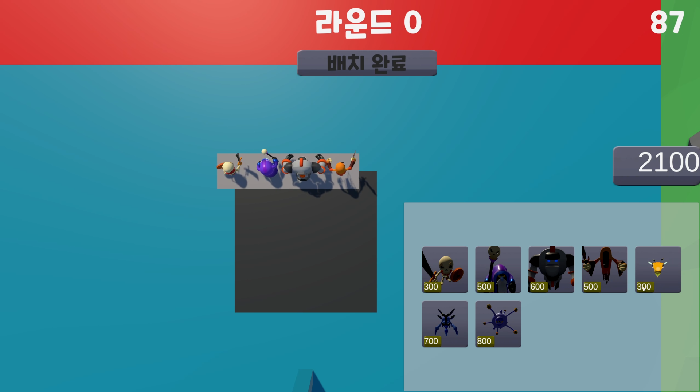
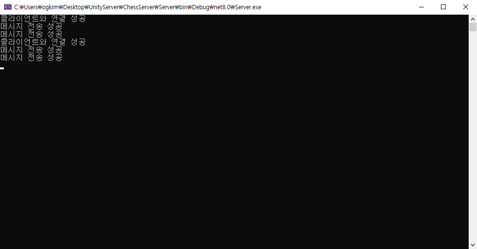

# MonsterChess
* 플레이 영상 : <https://www.youtube.com/watch?v=qKIiIdELATE>
* 다운로드 : <https://naver.me/x0UgC7i8>
  


***

* 작업 기간 : 2024. 12. 01 ~ 2025. 01. 26 (2개월)
* 인력 구성 : 1명
* 사용언어 및 개발환경 : C#, Unity

# Behavior Tree
* 몬스터의 AI를 Behavior Tree를 이용해 만들었습니다.
* Behavior Tree는 서버에서 돌아갑니다.
  


<details>
<summary> Behavior Tree(Server)</summary>
	
```cs
// 몬스터가 기본 베이스로 쓰는 변수를 모아놓은 BlackBoard이다. 
namespace ServerContent
{
    public class BlackBoard
    {
        public b_Object m_TargetObject = new b_Object();
        public b_float m_HP = new b_float();
        public b_float m_AttackDistance = new b_float();
        public b_float m_AttackRange = new b_float();
        public b_float m_AttackRangeCorrectionValue = new b_float();
        public b_float m_DefaultAttackDamage = new b_float();
        public b_float m_MoveSpeed = new b_float();
        public b_float m_ProjectTileSpeed = new b_float();
    }
}

// Selector, Sequence 노드 정의
namespace ServerContent
{
    // 노드를 만들기 위한 최상위 부모이다.
    public class ActionNode
    {
        public virtual ReturnCode Tick()
        {
            return ReturnCode.SUCCESS;
        }
    }

    // 생성할 때 Func 변수를 받아와 행동을 저장하고 Tick을 이용해 원할 때 실행할 수 있다.
    public class Action : ActionNode
    {
        Func<ReturnCode> m_Action;

        public Action(Func<ReturnCode> act)
        {
            m_Action = act;
        }

        public override ReturnCode Tick()
        {
            return m_Action.Invoke();
        }
    }

    // Behavior Tree의 기본 분기(Selector, Sequence의 기본틀)
    class Composite : ActionNode
    {
        // 전체 노드 수
        private static int g_NodeCount = -1;
        // 각각 노드 번호
        private int m_NodeCount = 0;
        // 몇번째 자식을 돌고 있는지 판별용
        protected int m_CurrentChild = 0;
        // 자식 리스트
        protected List<ActionNode> m_Children = new List<ActionNode>();
       
        // Decorate 미사용
        protected Composite()
        {
            Init();
        }

        protected virtual void Init()
        {
            g_NodeCount++;
            m_NodeCount = g_NodeCount;
        }

        public void AddChild(ActionNode child)
        {
            m_Children.Add(child);
        }

        public override ReturnCode Tick()
        {
            return ReturnCode.SUCCESS;
        }
    }

    // 인자값끼리 비교 체크 할 수 있다.
    // HP가 0 이하인지 체크하고 싶을 때 참조를 가진 현재 HP와 0인걸 체크하고 싶으니깐 0을 인자로 넣어주면 비교 할 수 있고 0일 때를 체크할 수 있다.
    class Composite<T, K> : Composite where T : IComparable where K : IBlackBoardKey<T>
    {
        // 블랙 보드 키값 비교용
        // 쿼리에 따라 비교
        private KeyQuery m_KeyQuery = KeyQuery.None;
        // 사용자 입력 값
        private T m_Key = default(T);
        // 참조를 위해 클래스 사용
        private K m_BlackBoardKey = default(K);
       
        protected bool UseSet = false;

        private Dictionary<KeyQuery, Func<IComparable, IComparable, bool>> m_QueryFuncMap = new Dictionary<KeyQuery, Func<IComparable, IComparable, bool>>();

        protected Composite(KeyQuery keyQuery, T keyValue, K blackBoardKey)
        {
            m_KeyQuery = keyQuery;
            m_Key = keyValue;
            m_BlackBoardKey = blackBoardKey;
        }

        protected override void Init()
        {
            base.Init();
            m_QueryFuncMap.Add(KeyQuery.IsEqualTo, DecorateFunc<IComparable>.IsEqualTo);
            m_QueryFuncMap.Add(KeyQuery.IsNotEqualTo, DecorateFunc<IComparable>.IsNotEqualTo);
            m_QueryFuncMap.Add(KeyQuery.IsLessThan, DecorateFunc<IComparable>.IsLessThan);
            m_QueryFuncMap.Add(KeyQuery.IsLessThanOrEqualTo, DecorateFunc<IComparable>.IsLessThanOrEqualTo);
            m_QueryFuncMap.Add(KeyQuery.IsGreaterThan, DecorateFunc<IComparable>.IsGreaterThan);
            m_QueryFuncMap.Add(KeyQuery.IsGreaterThanOrEqualTo, DecorateFunc<IComparable>.IsGreaterThanOrEqualTo);
        }

        protected bool DecorateCheck()
        {
            Func<IComparable, IComparable, bool> func;

            if (m_QueryFuncMap.TryGetValue(m_KeyQuery, out func))
            {
                if (func.Invoke(m_Key, m_BlackBoardKey.Key))
                {
                    return true;
                }

                return false;
            }

            return false;
        }
    }

    // 위와 비슷하지만 값의 비교가 아니라 현재 클래스가 유효한지 판정하기 위해서 사용한다.
    class SetComposite<T, K> : Composite where K : IBlackBoardKey<T>
    {
        // IsSet 비교용
        // 쿼리에 따라 비교
        private KeyQuery m_KeyQuery = KeyQuery.None;
        // 참조를 위해 클래스 사용
        private K m_BlackBoardKey = default(K);
       
        private Dictionary<KeyQuery, Func<K, bool>> m_QueryFuncMap = new Dictionary<KeyQuery, Func<K, bool>>();

        protected SetComposite(KeyQuery keyQuery, K blackBoardKey)
        {
            m_KeyQuery = keyQuery;
            m_BlackBoardKey = blackBoardKey;
        }

        protected override void Init()
        {
            base.Init();
            m_QueryFuncMap.Add(KeyQuery.IsEqualTo, SetDecorateFunc<T, K>.IsSet);
            m_QueryFuncMap.Add(KeyQuery.IsNotEqualTo, SetDecorateFunc<T, K>.IsNotSet);
        }

        protected bool DecorateCheck()
        {
            if (m_KeyQuery == KeyQuery.IsSet)
            {
                return SetDecorateFunc<T, K>.IsSet(m_BlackBoardKey);
            }

            return SetDecorateFunc<T, K>.IsNotSet(m_BlackBoardKey);
        }
    }

    // 자손이 모두 성공해야 Sequence도 성공
    class Sequence : Composite
    {
        public override ReturnCode Tick()
        {
            for (int i = m_CurrentChild; i < m_Children.Count; i++)
            {
                ReturnCode childStatus = m_Children[i].Tick();

                m_CurrentChild = i;

                if (childStatus == ReturnCode.RUNNING)
                {
                    return ReturnCode.RUNNING;
                }
                else if (childStatus == ReturnCode.FAIL)
                {
                    m_CurrentChild = 0;
                    return ReturnCode.FAIL;
                }
            }
            m_CurrentChild = 0;
            return ReturnCode.SUCCESS;
        }
    }

    // Sequnce의 인자 비교 버전
    class Sequence<T, K> : Composite<T, K> where T : IComparable where K : IBlackBoardKey<T>
    {
        public Sequence(KeyQuery keyQuery, T keyValue, K blackBoardKey) : base(keyQuery, keyValue, blackBoardKey)
        {

        }

        public override ReturnCode Tick()
        {
            if (!DecorateCheck()) return ReturnCode.FAIL;

            for (int i = m_CurrentChild; i < m_Children.Count; i++)
            {
                ReturnCode childStatus = m_Children[i].Tick();

                m_CurrentChild = i;

                if (childStatus == ReturnCode.RUNNING)
                {
                    return ReturnCode.RUNNING;
                }
                else if (childStatus == ReturnCode.FAIL)
                {
                    m_CurrentChild = 0;
                    return ReturnCode.FAIL;
                }
            }
            m_CurrentChild = 0;
            return ReturnCode.SUCCESS;
        }
    }

    // 값이 유효한지 알아보는 버전
    class SetSequence<T, K> : SetComposite<T, K> where K : IBlackBoardKey<T>
    {
        public SetSequence(KeyQuery keyQuery, K blackBoardKey) : base(keyQuery, blackBoardKey)
        {

        }

        public override ReturnCode Tick()
        {
            if (!DecorateCheck()) return ReturnCode.FAIL;

            for (int i = m_CurrentChild; i < m_Children.Count; i++)
            {
                ReturnCode childStatus = m_Children[i].Tick();

                m_CurrentChild = i;

                if (childStatus == ReturnCode.RUNNING)
                {
                    return ReturnCode.RUNNING;
                }
                else if (childStatus == ReturnCode.FAIL)
                {
                    m_CurrentChild = 0;
                    return ReturnCode.FAIL;
                }
            }
            m_CurrentChild = 0;
            return ReturnCode.SUCCESS;
        }
    }

    // 자손이 모두 실패하면 셀럭터도 실패 
    class Selector : Composite
    {
        public override ReturnCode Tick()
        {
            for (int i = m_CurrentChild; i < m_Children.Count; i++)
            {
                ReturnCode childStatus = m_Children[i].Tick();

                m_CurrentChild = i;

                if (childStatus == ReturnCode.RUNNING)
                {
                    return ReturnCode.RUNNING;
                }
                else if (childStatus == ReturnCode.SUCCESS)
                {
                    m_CurrentChild = 0;
                    return ReturnCode.SUCCESS;
                }
            }
            m_CurrentChild = 0;
            return ReturnCode.FAIL;
        }
    }

    // Selector의 인자 비교 버전
    class Selector<T, K> : Composite<T, K> where T : IComparable where K : IBlackBoardKey<T>
    {
        public Selector(KeyQuery keyQuery, T keyValue, K blackBoardKey) : base(keyQuery, keyValue, blackBoardKey)
        {

        }

        public override ReturnCode Tick()
        {
            if (!DecorateCheck()) return ReturnCode.FAIL;

            for (int i = m_CurrentChild; i < m_Children.Count; i++)
            {
                ReturnCode childStatus = m_Children[i].Tick();

                m_CurrentChild = i;

                if (childStatus == ReturnCode.RUNNING)
                {
                    return ReturnCode.RUNNING;
                }
                else if (childStatus == ReturnCode.SUCCESS)
                {
                    m_CurrentChild = 0;
                    return ReturnCode.SUCCESS;
                }
            }
            m_CurrentChild = 0;
            return ReturnCode.FAIL;
        }
    }

    // 값이 유효한지 알아보는 버전
    class SetSelector<T, K> : SetComposite<T, K> where K : IBlackBoardKey<T>
    {
        public SetSelector(KeyQuery keyQuery, K blackBoardKey) : base(keyQuery, blackBoardKey)
        {

        }

        public override ReturnCode Tick()
        {
            if (!DecorateCheck()) return ReturnCode.FAIL;

            for (int i = m_CurrentChild; i < m_Children.Count; i++)
            {
                ReturnCode childStatus = m_Children[i].Tick();

                m_CurrentChild = i;

                if (childStatus == ReturnCode.RUNNING)
                {
                    return ReturnCode.RUNNING;
                }
                else if (childStatus == ReturnCode.SUCCESS)
                {
                    m_CurrentChild = 0;
                    return ReturnCode.SUCCESS;
                }
            }
            m_CurrentChild = 0;
            return ReturnCode.FAIL;
        }
    }
}

// Behavior Tree에서 값 끼리 비교를 선택했을 때 비교해주는 함수
namespace ServerContent
{
    public class DecorateFunc<T> where T : IComparable
    {
        // 값이 같은지 비교 
        static public bool IsEqualTo(T keyValue, T blackBoardKey)
        {
            if (blackBoardKey.CompareTo(keyValue) == 0)
            {
                return true;
            }

            return false;
        }

        // 값이 다른지 비교
        static public bool IsNotEqualTo(T keyValue, T blackBoardKey)
        {
            if (blackBoardKey.CompareTo(keyValue) != 0)
            {
                return true;
            }

            return false;
        }

        // 값이 작은지 비교 
        static public bool IsLessThan(T keyValue, T blackBoardKey)
        {
            if (blackBoardKey.CompareTo(keyValue) < 0)
            {
                return true;
            }

            return false;
        }

        // 값이 작거나 같은지 비교 
        static public bool IsLessThanOrEqualTo(T keyValue, T blackBoardKey)
        {
            if (blackBoardKey.CompareTo(keyValue) <= 0)
            {
                return true;
            }

            return false;
        }

        // 값이 큰지 비교 
        static public bool IsGreaterThan(T keyValue, T blackBoardKey)
        {
            if (blackBoardKey.CompareTo(keyValue) > 0)
            {
                return true;
            }

            return false;
        }

        // 값이 크거나 같은지 비교  
        static public bool IsGreaterThanOrEqualTo(T keyValue, T blackBoardKey)
        {
            if (blackBoardKey.CompareTo(keyValue) >= 0)
            {
                return true;
            }

            return false;
        }
    }

    public class SetDecorateFunc<T, K> where K : IBlackBoardKey<T>
    {
        // 값이 유효한지 
        static public bool IsSet(K blackBoardKey)
        {
            if (blackBoardKey.Key == null) return false;

            if (blackBoardKey.Key is null)
                return false; // 참조형이 null이면 값 없음
            
            if (EqualityComparer<T>.Default.Equals(blackBoardKey.Key, default(T)))
                return false; // 값 형식이 기본값(0, false 등)이면 값 없음

            return true; // 값이 있는 경우
        }

        // 값이 유효하지 않은지
        static public bool IsNotSet(K blackBoardKey)
        {
            if (blackBoardKey.Key == null) return true;

            if (blackBoardKey.Key is null)
                return true; // 참조형이 null이면 값 없음

            if (EqualityComparer<T>.Default.Equals(blackBoardKey.Key, default(T)))
                return true; // 값 형식이 기본값(0, false 등)이면 값 없음

            return false; // 값이 있는 경우
        }
    }
}

 // 블랙보드 키값 세팅 json 파일을 이용해서 데이터를 가져와 적용한다.
 protected override void SetBlackBoardKey()
 {
     // 클라에서 이름 정보 받아오면 이름 정보로 교체
     m_BlackBoard.m_TargetObject.Key = m_TargetLab;
     m_BlackBoard.m_HP.Key = Managers.Data.m_MonsterDict[m_Name].hp;
     m_BlackBoard.m_AttackDistance.Key = Managers.Data.m_MonsterDict[m_Name].attackDistance;
     m_BlackBoard.m_AttackRange.Key = Managers.Data.m_MonsterDict[m_Name].attackRange;
     m_BlackBoard.m_AttackRangeCorrectionValue.Key = Managers.Data.m_MonsterDict[m_Name].attackRangeCorrectionValue;
     m_BlackBoard.m_DefaultAttackDamage.Key = Managers.Data.m_MonsterDict[m_Name].defaultAttackDamage;
     m_BlackBoard.m_MoveSpeed.Key = Managers.Data.m_MonsterDict[m_Name].moveSpeed;
     m_BlackBoard.m_ProjectTileSpeed.Key = Managers.Data.m_MonsterDict[m_Name].projectTileSpeed;
 }

// 캐릭터에 맞는 Behavior Tree를 생성한다.
private void MakeBehaviorTree()
{
    // HP관리
    // 공격 관리
    Selector attackMgr = new Selector();
    m_Selector.AddChild(attackMgr);

    SetSequence<object, b_Object> checkTargetLive = new SetSequence<object, b_Object>(KeyQuery.IsSet, m_BlackBoard.m_TargetObject);
    attackMgr.AddChild(checkTargetLive);

    Sequence<float, b_float> checkAttackRange = new Sequence<float, b_float>(KeyQuery.IsLessThanOrEqualTo, m_BlackBoard.m_AttackRange.Key, m_BlackBoard.m_AttackDistance);
    checkTargetLive.AddChild(checkAttackRange);

    Action attackAction = new Action(Attack);
    checkAttackRange.AddChild(attackAction);

    // 이동 관리
    Selector moveMgr = new Selector();
    m_Selector.AddChild(moveMgr);

    SetSequence<object, b_Object> move = new SetSequence<object, b_Object>(KeyQuery.IsSet, m_BlackBoard.m_TargetObject);
    moveMgr.AddChild(move);
    Action moveAction = new Action(MoveToPosition);

    move.AddChild(moveAction);
}

// 위의 Action으로 넣어준 함수 두가지

// 공격하는 패킷을 클라이언트로 쏘아준다.
 private ReturnCode Attack()
 {
     m_MonsterState = MonsterState.Attack;
     S_BroadcastMonsterStatePacket monsterStatePacket = new S_BroadcastMonsterStatePacket();
     monsterStatePacket.m_MonsterId = (ushort)m_ObjectId;
     monsterStatePacket.m_CurrentState = (ushort)m_MonsterState;
     monsterStatePacket.m_PosX = m_Position.X;
     monsterStatePacket.m_PosY = m_Position.Y;
     monsterStatePacket.m_PosZ = m_Position.Z;

     TransportPacket(() => Program.g_GameRoom.BroadCast(monsterStatePacket.Write()));
     
     return ReturnCode.SUCCESS;
 }

// 몬스터의 상태랑 현재 위치를 패킷으로 쏘아보낸다. 
private ReturnCode MoveToPosition()
{
    m_MonsterState = MonsterState.Move;
    Vector3 dir = m_Target.m_Position - m_Position;

    if (dir == Vector3.Zero)
    {
        dir = Vector3.Zero;
    }
    else
    {
        dir = Vector3.Normalize(dir);
    }
    float fixY = m_Position.Y;
    m_Position += dir * m_BlackBoard.m_MoveSpeed.Key * (float)LTimer.m_SPF;
    m_Position = new Vector3(m_Position.X, fixY, m_Position.Z);
    // 패킷 보내기
    S_BroadcastMovePacket movePacket = new S_BroadcastMovePacket();
    movePacket.m_MonsterId = (ushort)m_ObjectId;
    movePacket.m_PosX = m_Position.X;
    movePacket.m_PosY = m_Position.Y;
    movePacket.m_PosZ = m_Position.Z;

    S_BroadcastMonsterStatePacket monsterStatePacket = new S_BroadcastMonsterStatePacket();
    monsterStatePacket.m_MonsterId = (ushort)m_ObjectId;
    monsterStatePacket.m_CurrentState = (ushort)m_MonsterState;

    TransportPacket(() => Program.g_GameRoom.BroadCast(monsterStatePacket.Write()));
    TransportPacket(() => Program.g_GameRoom.BroadCast(movePacket.Write()));
    
    return ReturnCode.SUCCESS;
}

```

</details>

* 클라이언트에선 서버에서 보내준 상태를 받아와서 상태에 따라 애니메이션을 재생시켜줍니다.

<details>
<summary> Behavior Tree(Client)</summary>
	
```cs
// 브로드캐스트 된 패킷을 받아 역직렬화 하고 몬스터 ID를 이용해 해당하는 몬스터에게 현재 상태를 넣어준다.
public void S_BroadcastMonsterStatePacketHandler(Session session, IPacket packet)
{
    S_BroadcastMonsterStatePacket monsterStatePacket = packet as S_BroadcastMonsterStatePacket;
    GameObject obj = Managers.Monster.GetMonster(monsterStatePacket.m_MonsterId);

    if (obj != null)
    {
        Vector3 serverPos = new Vector3(monsterStatePacket.m_PosX, monsterStatePacket.m_PosY, monsterStatePacket.m_PosZ);
       
        if (obj.GetComponent<BaseMonster>().MonsterState != MonsterState.Attack &&
            (MonsterState)monsterStatePacket.m_CurrentState == MonsterState.Attack)
        {
            if (Vector3.Distance(obj.transform.position, serverPos) >= 0.1f)
            {
                if (obj.layer != (int)Global.g_MyTeam) return;
                C_ConfirmMovePacket confirmMovePacket = new C_ConfirmMovePacket();
                confirmMovePacket.m_MonsterId = (ushort)obj.GetComponent<BaseObject>().ObjectId;
                SessionManager.Instance.GetServerSession().Send(confirmMovePacket.Write());
                return;
            }
        }
        obj.GetComponent<BaseMonster>().MonsterState = (MonsterState)monsterStatePacket.m_CurrentState;
    }
}

// 유니티 Update에서 패킷으로 받아온 상태가 바뀌면 상태에 따른 애니메이션을 재생시켜준다.
private void StateUpdate()
{
    switch (MonsterState)
    {
        case MonsterState.Idle:
            IDLE();
            break;
        case MonsterState.Move:
            Move();
            break;
        case MonsterState.Attack:
            Attack();
            break;
        case MonsterState.None:
            break;
        default:
            break;
    }
}

// IDLE은 기본 애니메이션으로 설정했기에 따로 행동이 없다.
private void IDLE()
{
    
}

// 애니메이션을 재생하고 서버에서 받아온 좌표를 받아 이동한다. 
private void Move()
{
    monsterAnimation.SetBool("IsMove", true);
    transform.LookAt(Target.transform);
    transform.position = Vector3.MoveTowards(gameObject.transform.position, MovePos, blackBoard.m_MoveSpeed.Key * Time.deltaTime);
    Vector3 fixYPos = new Vector3(transform.position.x, initialY, transform.position.z);
    transform.position = fixYPos;
}

// 몬스터가 죽었을 때 애니메이션 재생과 알파값 조절로 투명화 죽었을 때 이벤트를 뿌린다.
public override void Death()
{
    monsterAnimation.SetBool("IsDeath", true);
    StartCoroutine(DecreaseAlpha());
    IsDeath = true;
    BaseMonster.monsterDeathEvent.Invoke();
}
```

</details>

# Server
* 비동기 함수 Recv, Send를 이용해 패킷을 주고 받습니다.
  





